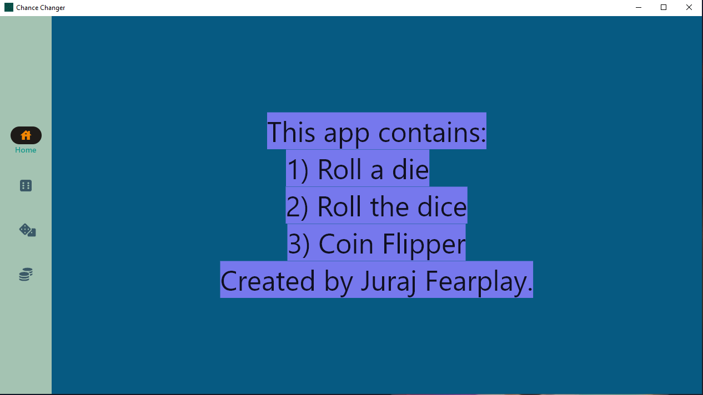
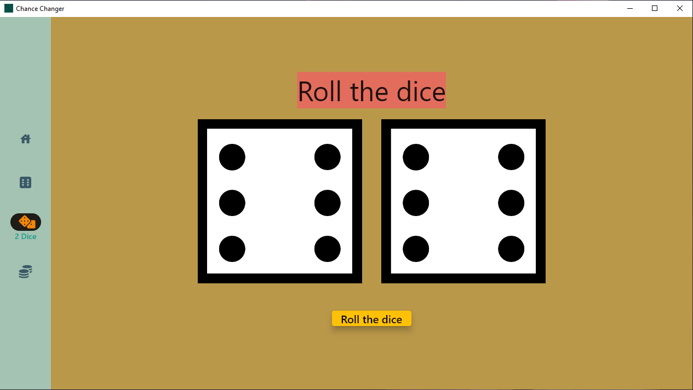

# Chance-Changer

Desktop app made in flutter which contains:
1. Roll 1 die
2. Roll 2 dice
3. Coin flipper

## Table of Contents
- [Get the app](#get-the-app)
- [Screenshots](#screenshots)
- [General](#general)
- [Requirements](#requirements)
- [Resources](#resources)
- [Other](#other)

## Get the app
- [Microsoft Store](https://apps.microsoft.com/store/detail/chance-changer/9PKC6WWB53ZQ)

## Screenshots

## General
* If you miss a die or dice in a board game. You can download this project and use it to **roll dice**.
* Or if you and your friend can't agree on something, use the **coin flipper** to settle your quarrels.

## Requirements
- Make sure to use **pub get**. Everything needed to run the application is in the **pubspec.yaml** file.

## Resources
1. Coin and Dice icons
- [Flutter Icons](https://www.fluttericon.com/)
- [Font Awesome Git](https://github.com/FortAwesome/Font-Awesome)
2. For Dice pictures
- [Mini Paint](https://github.com/viliusle/miniPaint)
3. For Coin pictures
- [Paint3D](https://apps.microsoft.com/store/detail/malov%C3%A1n%C3%AD-3d/9NBLGGH5FV99)
4. For Window Size
- [window_size](https://github.com/google/flutter-desktop-embedding)
5. For alert
- [rflutter_alert](https://pub.dev/packages/rflutter_alert)
6. For logo
- [Piskel App](https://github.com/piskelapp/piskel)

## Other
* If you find any issue, please don't hesitate to report it via [Issues](https://github.com/Fearplay/Chance-Changer/issues)
* If you have an idea to improve this game, please don't hesitate to create pull request via [Pull requests](https://github.com/Fearplay/Chance-Changer/pulls)
* Thanks to all :green_heart:

[Back to TOP](#chance-changer)
